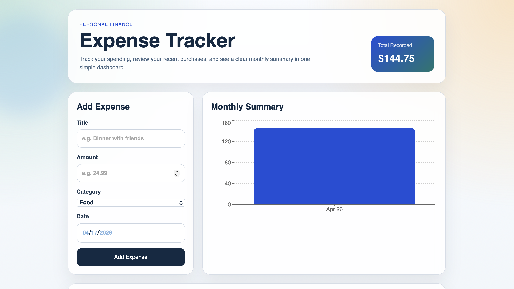
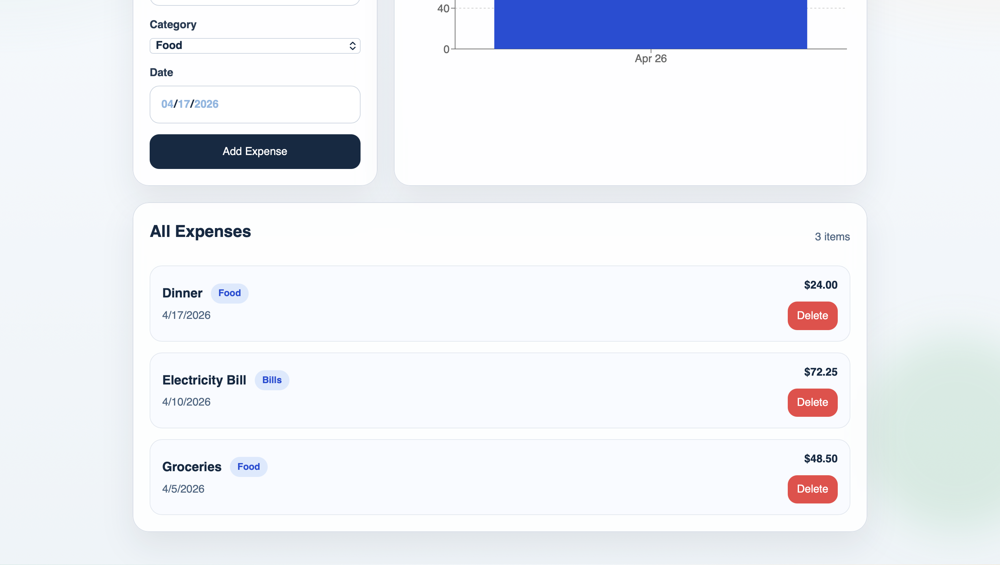

# Expense Tracker App

A full-stack expense tracker that helps users manage daily expenses and visualize spending patterns through an interactive dashboard.

A full-stack expense tracker built with:

- React + Vite for the frontend
- Node.js + Express for the backend
- A local JSON file for data storage
- Recharts for the monthly summary chart

## Highlights

- Clean and responsive UI
- Real-time expense updates
- Visual monthly spending insights
- Simple and beginner-friendly architecture

## Project Structure

```text
expense-tracker/
  client/   # React frontend
  server/   # Express backend
```

## Features

- Add a new expense with title, amount, category, and date
- View all saved expenses in a clean list
- Delete any expense
- See a monthly expenses summary chart
- Store expense data in `server/data/expenses.json`

## Screenshots

### Dashboard Overview



### Expense List



## How to Run the Project

Open two terminal windows.

### 1. Start the backend

```bash
cd server
npm install
npm run dev
```

The backend will run at `http://localhost:5001`.

### 2. Start the frontend

```bash
cd client
npm install
npm run dev
```

The frontend will run at `http://localhost:5173`.

## API Routes

- `GET /expenses` - Fetch all expenses
- `POST /expenses` - Add a new expense
- `DELETE /expenses/:id` - Delete an expense

## What I Learned

- Building a full-stack application from scratch
- Connecting frontend and backend using REST APIs
- Managing application state in React
- Handling data persistence using a backend service

## Notes

- Data is stored in a local JSON file, so no database setup is required.
- A couple of demo expenses are included to make the UI look populated on first run.
- If you want to reset the data, edit `server/data/expenses.json`.
